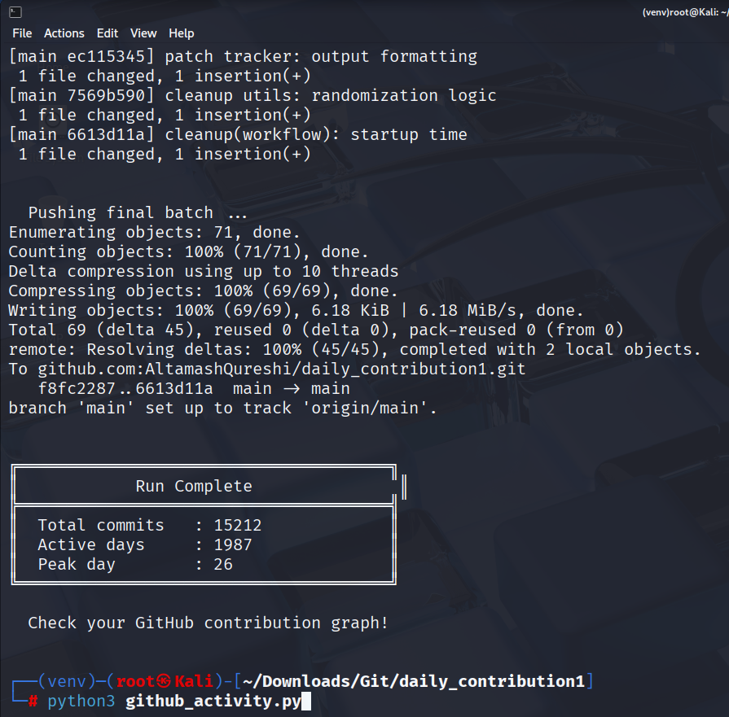

# GitHub Activity Graph Enhancer v3.0

A Python script that fills your GitHub contribution graph with realistic commits — complete with natural burst streaks, weighted daily commit counts, and human-like commit timestamps.

---

## Features

- Generates commits across a custom date range
- Weighted commit distribution (0–18 commits/day) for a natural look
- Burst streak mode — simulates productive sprints lasting 3–7 days
- 70% of commits land in working hours (08:00–20:00)
- Batched pushes to avoid rate limits
- Resume support via checkpoint file — safely restart if interrupted
- Realistic commit messages using action + scope + detail vocabulary

---

## Requirements

- Python 3.8+
- A GitHub Personal Access Token (PAT) with `repo` scope
- Git installed and configured on your machine

---

## Pre-requisites

Run the following commands to set up your environment before using the script:

```bash
# Create virtual environment
python3 -m venv venv

# Activate venv on Linux/macOS
source venv/bin/activate

# Upgrade pip
pip install --upgrade pip

# Install requests
pip install requests

# Create .gitignore
cat > .gitignore <<EOF
venv/
*.py
*.pyc
__pycache__/
EOF

# Verify active venv
which python
which pip

# Initialise git and make the first commit
git init
git add .
git commit -m "Initial commit with venv and requests setup"
```

> 💡 On **Windows**, activate the venv with `venv\Scripts\activate` instead.

---

## Setup

**1. Clone your target repo**

```bash
git clone https://github.com/your-username/your-repo.git
cd your-repo
```

**2. Place the script inside the repo directory**

```bash
cp github_activity.py your-repo/
```

**3. Generate a GitHub Personal Access Token**

Go to: `GitHub → Settings → Developer Settings → Personal Access Tokens → Tokens (classic)`

Grant the **`repo`** scope and copy the token.

**4. Edit the CONFIG section at the top of the script**

```python
START_DATE      = datetime(2020, 1, 5)          # Start of date range
END_DATE        = datetime.today()              # End of date range (default: today)

GIT_EMAIL       = "your-email@example.com"     # Email linked to your GitHub account
GIT_NAME        = "your-github-username"       # Your GitHub display name
GITHUB_TOKEN    = "ghp_xxxxxxxxxxxx"           # Your Personal Access Token
GITHUB_USERNAME = "your-github-username"       # Your GitHub username
GITHUB_REPO     = "your-repo-name"             # Repo name or full URL
```

> ⚠️ Never commit your token to a public repository.

---

## Running the Script

```bash
python github_activity.py
```

The script will:
1. Validate your config
2. Set up git user config and initialize the log file
3. Loop through each day in the date range, making commits
4. Push commits in batches of 150
5. Print a summary when complete

---

## Configuration Reference

| Variable | Default | Description |
|---|---|---|
| `START_DATE` | `datetime(2020, 1, 5)` | First day to generate commits from |
| `END_DATE` | `datetime.today()` | Last day to generate commits |
| `GIT_EMAIL` | — | Email associated with your GitHub account |
| `GIT_NAME` | — | Your GitHub display name |
| `GITHUB_TOKEN` | — | Personal Access Token with `repo` scope |
| `GITHUB_USERNAME` | — | Your GitHub username |
| `GITHUB_REPO` | — | Repo name or full GitHub URL |
| `BRANCH` | `main` | Branch to push commits to |
| `LOG_FILE` | `activity.log` | File used to record each commit entry |
| `COMMIT_WEIGHTS` | See script | Weighted distribution of daily commit count (0–18) |
| `BURST_WEEK_PROBABILITY` | `0.08` | Chance any given day starts a burst streak |
| `BURST_BONUS_MIN` | `4` | Minimum extra commits added during a burst day |
| `BURST_BONUS_MAX` | `8` | Maximum extra commits added during a burst day |
| `API_MAX_RETRIES` | `4` | Max retries on network/API failure |
| `API_RETRY_DELAY` | `6` | Seconds to wait between retries |
| `PUSH_BATCH_SIZE` | `150` | Number of commits before triggering a push |
| `CHECKPOINT_FILE` | `.activity_checkpoint` | File used to track resume position |

---

## Resume Support

If the script is interrupted, it saves progress to `.activity_checkpoint`. Re-running the script will automatically resume from where it left off.

To start fresh, delete the checkpoint file:

```bash
rm .activity_checkpoint
```

---

## Sample Output

```
  Date range  : 2020-01-05 -> 2025-04-19
  Total days  : 1932
  Commit dist : 0-18/day  (weighted)

  [████████████████░░░░░░░░░░░░░░░░░░░░░░]   850/1932  2022-04-14  burst    9 commits


╔══════════════════════════════════════╗
║            Run Complete               ║
╠══════════════════════════════════════╣
║  Total commits   : 8241              ║
║  Active days     : 1604              ║
║  Peak day        : 26                ║
╚══════════════════════════════════════╝

  Check your GitHub contribution graph!
```

---

## Proof of Run

The screenshot below shows a successful real execution of the script — **15,212 commits** pushed across **1,987 active days** with a peak of **26 commits** in a single day.



---

## Notes

- The script modifies `GIT_AUTHOR_DATE` and `GIT_COMMITTER_DATE` to backdate commits — this is what populates the contribution graph historically.
- GitHub only counts commits on the **default branch** or branches merged into it toward the contribution graph.
- Make sure the email in `GIT_EMAIL` matches the email on your GitHub account, otherwise commits won't be counted.
- If a push is rejected due to diverged history, the script automatically falls back to `--force-with-lease`.

---

## License

MIT — use at your own discretion.
